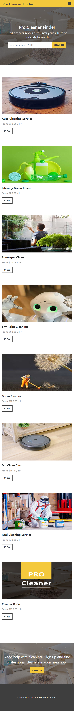

# Pro Cleaner Finder - Two-Way Marketplace

>
> GitHub repository link: [https://github.com/petitejess/pro-cleaner-finder](https://github.com/petitejess/pro-cleaner-finder)
>
>
> Live website link: [https://pro-cleaner-finder.herokuapp.com/](https://pro-cleaner-finder.herokuapp.com/)
>

&nbsp;  

Sample users:

- As Cleaners, emails: procleaner@mail.com, procleaner1@mail.com, password: 123123
- As Customers, emails: customer@mail.com, customer1@mail.com, password: 123123

&nbsp;  

<!-- TABLE OF CONTENTS -->

  
Table of Contents

  <ol>
    <li>
      <a href="#purpose">Purpose</a>
      <ul>
        <li><a href="#what-it-does">What It Does</a></li>
        <li><a href="#problems">Problems</a></li>
        <li><a href="#solutions">Solutions</a></li>
        <li><a href="#target-audience">Target Audience</a></li>
      </ul>
    </li>
    <li>
      <a href="#features">Features</a>
      <ul>
        <li><a href="#user-stories">User Stories</a></li>
        <li><a href="#main-features">Main Features</a></li>
        <li><a href="#supporting-features">Supporting Features</a></li>
        <li><a href="#coming-features">Coming Features</a></li>
      </ul>
    </li>
    <li>
      <a href="#user-interface-and-user-experience">User Interface and User Experience</a>
      <ul>
        <li><a href="#sitemap">Sitemap</a></li>
        <li><a href="#wireframes">Wireframes</a></li>
        <li><a href="#screenshots">Screenshots</a></li>
        <li><a href="#user-journeys">User Journeys</a></li>
      </ul>
    </li>
    <li>
      <a href="#er-diagram">ER Diagram</a>
      <ul>
        <li><a href="#initial-erd">Initial ERD</a></li>
        <li><a href="#high-level-components">High-Level Components</a></li>
        <li><a href="#current-database-schema">Current Database Schema</a></li>
        <li><a href="#models-and-relations">Models and Relations</a></li>
      </ul>
    </li>
    <li>
      <a href="#implementation-schedule">Implementation Schedule</a>
      <ul>
        <li><a href="#trello-summary">Trello Summary</a></li>
        <li><a href="#trello-screenshots">Trello Screenshots</a></li>
      </ul>
    </li>
    <li>
      <a href="#development-configurations">Development Configurations</a>
      <ul>
        <li><a href="#tech-stack">Tech Stack</a></li>
        <li><a href="#dependencies">Dependencies</a></li>
        <li><a href="#third-party-services">Third-Party Services</a></li>
      </ul>
    </li>
    <li><a href="#licenses">Licenses</a></li>
  </ol>

&nbsp;  

## Purpose

### What It Does

Pro Cleaner Finder is a two-way marketplace for people to find professional cleaning services. The app will provide a way for users to easily find available cleaners that provide services in the suburb their properties are located.

It allows users to check a listing information, cleaner information, and reviews from customers given for the listing. When users register and sign in, they can check further about a cleaner’s details, such as all services offered, all reviews earned, and user can request a quote for a cleaning job from the listing page.

On the other hand, for professional cleaners, they have the benefit of exposure to customers living in their service areas. They could also get a request for a quote and send the quote directly from the app. Once a quote is approved and paid by customer through the app, a job is created for them as reference for the service details.

### Problems

For professional domestic cleaning service, either regular or one-off, both cleaners and customers reputations (ratings and reviews) play a big role for continuity of the business. It is important to see if the service provided is worth the money spent or the work taken is worth the sweat.

Currently, there are only a few marketplaces for professional cleaners in Australia, while Airtasker is not specialised for professional cleaners.

The available marketplaces do not have an easy overview to browse the available cleaners that service the areas. The flow for customer to use their platform is directly to get a quote which pricing is set and controlled by the platform, not by the registered cleaners. Customers don't get to check or choose specifically which cleaners are sent to their place as they are all managed by the platform owner. Not much flexibility for both customers and cleaners.

### Solutions

This Pro Cleaner Finder app’s hope is to bring the flexibility we have with Airtasker, but with more specialised configurations for professional cleaners.
Professional cleaners need to have an ABN as they are considered a sole trader working as a contractor and a Police Check. A cleaner who is insured (Public Liability Insurance) is also preferable, while not mandatory. Therefore, that information would be important for customers to check prior getting a service.

This app is an initial ideation to make it easy for both customers and cleaners to manage their businesses. For customers, that would be effortless attempts to find cleaners in their areas, get a quote for a job, book and pay. For cleaners, that would be better exposure of their business in their areas of services, get their services and information easily found by prospective customers.

In the future, the hope is for the app to be extended to become a Customer Relationship Management system for cleaners and customers to easily manage quotes, bookings, regular billings, and service scheduling.

### Target Audience

The app is designed for both professional cleaners and customers (general public).

Professional cleaners can be of those who provide professional domestic, as well as commercial, cleaning services as a sole trader, with National Police Check reference and Australian Business Number.

Customers can be individuals or business/company who are looking for trusted cleaners for a one-off or regular professional cleaning services for either home or workplace.

&nbsp;

---

&nbsp;  

## Features

### User Stories

Customer’s point of view:

- As a *customer*, I want to be able to **search cleaners that service certain suburb/postcode**, so I do not have to go through multiple cleaner websites to find out their service area manually.
- As a *customer*, I want to be able to **check the cleaner's reputation**, so I can set my expectations.
- As a *customer*, I want to be able to **get a quote** from available cleaners for a job, so I can choose the best offer.

Professional cleaner’s point of view:

- As a professional *cleaner*, I want to set my **service area**, so I do not waste time on travel.
- As a professional *cleaner*, I want to be able to show customers **multiple listings** that I offer, so I could sell my services with different pricing.
- As a professional *cleaner*, I want to be able to provide **quotation** before taking a job, so I do not get underpaid.

### Main Features

#### 1. Search listings based on suburb/postcode of service areas

Cleaners can create multiple listings for different services that they offer. Each listing has service areas offered that customer can search through the search bar on the homepage. They can be searched by suburb name or postcode number.

#### 2. Page that displays cleaner’s information, services provided and reviews

Customers and cleaners have different information asked during profile creations through different registration links provided. Customers have information about their property shown to cleaners upon requesting for a quote. Cleaners have information about their National Police Check reference number, Australian Business Number, all services provided (listings), and all reviews earned.

<!-- GIFs -->

  
... List of Other GIFs

  &nbsp;  

  

  

  

  

  

&nbsp;  

#### 3. Requests a quote through a listing, leaves a review

Registered and signed in customers can request a quote through a listing. Cleaners can review the request then give a quote. Customers then check the quote and can either reject it or accept it (where it becomes a job). Only after a job is booked that a customer can leave a review for the job.

<!-- GIFs -->

  
... List of Other GIFs

  &nbsp;

  

  

  

&nbsp;  

### Supporting Features

#### Payment gateway

After a job is created, customer can pay for it by clicking a Pay Now button on the job’s page which directs them to a Stripe payment gateway page. If the payment is successful, customer will be redirected back to the job’s page with updated payment details and a Leave a Review can then leave a review for the job.

### Coming Features

#### Internal messaging

A customer and cleaners will be able to send and receive messages about a listing directly from the app. This feature is still under development.

&nbsp;

---

&nbsp;  

## User Interface and User Experience

### Sitemap

### Wireframes

### Screenshots

&nbsp;

<!-- Website Screenshots -->

  
... List of Other Website Screenshots

  &nbsp;

  

  

  

  

  
  
  

  

  

  
  
  

  

  

  

  

&nbsp;

### User Journeys

#### Customer’s User Journey

A normal user journey would look like:

Customer that is not registered/logged in:

1. Can view homepage and use the search bar to search listings
2. Can view individual listing page with limited sections:
- Listing title, image, description, service areas
- Brief cleaner’s information
- Reviews for the listing
3. Can choose to register through **Sign Up** link

Customer that wants to register:

1. Can enter their email and setup a password through **Sign Up** page
2. Need to create a profile before allowed access to other restricted pages
3. After profile creation, **My Profile**, **Quotes**, **Jobs**, **Log Out** menu become available

Registered and logged in customer:

1. Can log in through **Log In** menu
1. Can view their own profile page through **My Profile** menu
1. Can view individual listing, and send request for a quote
1. Can check any quotes owned through **Quotes** menu
1. Can view individual quote and approve/reject it
1. Can view all jobs owned through **Jobs** menu
1. Can pay for a job, then leave a review for the job

#### Cleaner’s User Journey

Cleaner that is not registered/logged in:

1. Can view homepage and use the search bar to search listings
2. Can view individual listing page with limited sections:
- Listing title, image, description, service areas
- Brief cleaner’s information
- Reviews for the listing
3. Can choose to register through **Register as Pro** link

Cleaner that wants to register:

1. Can enter their email and setup a password through ** Register as Pro** page
2. Need to create a profile before allowed access to other restricted pages
3. After profile creation, **My Profile**, **Quotes**, **Jobs**, **My Listings**, **Log Out** menu become available

Registered and logged in cleaner:

1. Can log in through **Log In** menu
1. Can view their own profile page through **My Profile** menu
1. Can view all listings owned through **My Listings** menu
1. Can view and edit individual listing
1. Can check any quotes owned through **Quotes** menu
1. Can view individual quote and respond to quote request from customer
1. Can view all jobs owned through **Jobs** menu

&nbsp;

---

&nbsp;  

## ER Diagram

### Initial ERD

### High-Level Components

#### User Profile Component

The profile component would be user related entity that would describe the type of users and their attributes. The app allows for two different user types, *Cleaner* and *Customer*, that share common attributes (login credentials, names, and contact details), with additional attributes different for each type (documentation for Cleaner and property for Customer).

This component would receive input through forms in the view, related to user information, pass by the controllers to the model to be stored in the relevant tables. The data can then be retrieved again from model by the controller to the view when customers viewing a cleaner’s profile, or when customer’s information presented to cleaners during quoting process.

#### Service Component

Information about services that the cleaners offer would be represented by the service component. Details such as the cleaner’s/customer’s information, standard hourly rate and the areas of service would be described by the service component in the form of a listing.

Customers would be able to filter services based on the area covered, as set by the cleaners. Cleaners would be able to describe different services that they may have. They would need to fill out a form in the view with information about the service, which the controller will take and pass to model to be stored in the relevant tables. The data will be retrieved from model by controller back to the view each time customers view a listing. 

#### Job Components

Job component would track the process of quoting to booking a job. Customers would be able to request for a quote for a cleaning job, and cleaners would be able to respond and provide a quote. Approved quote would become a job. This process will be tracked by job components.

The process starts with the customer viewing a listing for a service, directly request for a quote through the listing. The customers detail would be sent automatically to the listing’s owner (the cleaner) upon sending the request. This would be done through a form in the listing page. The input will be passed from the view to the controller and stored in the database through the relevant model.

Then, the cleaner who receives the request could see the details of the request and send back a quote to the customer. This would also be done through a form on the quote view, which on the same time, showing the details of the request passed from the model by the controller.

#### Review Component

A paid job would allow the customer to leave a review. This is done through a review form in the view, which then the input will be passed by the controller to the model to be stored in the database. The data will be retrieved though the model by the controller to the cleaner’s profile view, relevant job and listing’s view.

### Current Database Schema

The relationships between the tables are the same as in initial ERD with exception of the image table. It has been replaced with active_storage_attachments polymorphic join table. And the Suburb, Postcode, and State tables have been merged into one table with suburb, postcode, state as attributes due to over normalised tables, making them hard to work with jQuery Autocomplete and Postcode API implementation.

The active_storage_attachments has a one-to-one relationship with Profile and/or Listing (has_one_attached macro used in the model). Profile/Listing can have 0 or 1 image attachment, and image attachment belong to exactly one Profile/Listing. The active_storage_attachments table has a foreign key of record_id that holds profile_id/listing_id value.

The active_storage_attachments table has a one-to-one relationship with active_storage_blobs. Image attachment has exactly one blob, and blob belongs to exactly one image.
 The active_storage_blobs has a one-to-many relationship with active_storage_variant_records. Blob can have 0 or many variants, and variant must belong to exactly one blob.

The suburbs table that replaces three tables (Suburb, Postcode, State) would store unique sets of suburb-postcode-state combination. The suburbs table has a many-to-many relationship with listings through service areas table. Suburb can have many Listings and Listing can have many Suburbs. The suburbs table also has a one-to-many relationship with properties table Property must belong to exactly one Suburb, and Suburb may have 0 or many Properties.

### Models and Relations

There are 15 tables used to hold data for the app. Models in the app were created based on the tables. The relationships between the models are explained below.

#### User and Profile
User has a one-to-one relationship with Profile. User has exactly 1 Profile, and Profile must belong to exactly one User. Profile table has a foreign key of user_id that connects the two tables.

#### Profile and Documentation
Profile has a one-to-one relationship with Documentation. Profile may have 0 or 1 Documentation, and Documentation must belong to exactly one Profile. Documentation table has a foreign key of profile_id that connects the two tables.

#### Profile and Property
Profile has a one-to-one relationship with Property. Profile may have 0 or 1 Property, and Property must belong to exactly one Profile. Property table has a foreign key of profile_id that connects the two tables.

#### Property and Suburb
Property has a many-to-one relationship with Suburb. Property must belong to exactly one Suburb, and Suburb may have 0 or many Properties. Property table has a foreign key of suburb_id that connects the two tables.

#### Profile and Image
Profile has a one-to-one relationship with Image. Profile can have 0 or 1 Image, and Image belong to exactly one Profile. Image table is a polymorphic join table that has a foreign key of record_id that holds profile_id value which connects the two tables.

#### Profile and Review
Profile has a one-to-many relationship with Review. Profile may have 0 or many Reviews, and Review must belong to exactly 1 Profile (through *from* and *to* attributes). Review table has foreign keys of review_from and review _to that hold value of profile_id which connects the two tables.

#### Profile and Listing
Profile has a one-to-many relationship with Listing. Profile may have 0 or many Listings, and Listing must belong to exactly 1 Profile. Listing table has a foreign key of profile_id that connects the two tables.

#### Listing and Image
Listing has a one-to-one relationship with Image. Listing can have 0 or 1 Image, and Image belong to exactly one Listing. Image table is a polymorphic join table that has a foreign key of record_id that holds listing_id value which connects the two tables.

#### Listing and Service Area
Listing has a many-to-many relationship with Suburb through Service Area. Listing must have at least 1 or many Suburbs, and Suburb must have at least 1 or many Listings through Service Area. Service Area table has a foreign key of listing_id that connects the two tables.

#### Service Area and Suburb
ServiceArea has a many-to-one relationship with Suburb. ServiceArea must belong to exactly 1 Suburb, and Suburb may have 1 or many ServiceArea. Service Area table has a foreign key of suburb_id that connects the two tables.

#### Listing and Request
Listing has a one-to-many relationship with Request. Listing may have 0 or many Request, and Request must belong to exactly 1 Listing. Request table has a foreign key of listing_id that connects the two tables.

#### Property and Request
Property has a one-to-many relationship with Request. Property may have 0 or many Request, and Request must belong to exactly 1 Property. Request table has a foreign key of property_id that connects the two tables.

#### Request and Quote
Request has a one-to-one relationship with Quote. Request can have 0 or 1 Quote, and Quote must belong to exactly one Request. Quote table has a foreign key of request_id that connects the two tables.

#### Quote and Job
Quote has a one-to-one relationship with Job. Quote can have 0 or 1 Job, and Job must belong to exactly one Quote. Job table has a foreign key of quote_id that connects the two tables.

#### Job and Payment
Job has a one-to-one relationship with Payment. Job may have 0 or 1 Payment, and Payment must belong to exactly one Job. Payment table has a foreign key of job_id that connects the two tables.

#### Job and Review
Job has a one-to-one relationship with Review. Job may have 0 or 1 Review, and Review must belong to exactly one Job. Review table has a foreign key of job_id that connects the two tables.

&nbsp;

---

&nbsp;  

## Implementation Schedule

>
> Trello board link: https://trello.com/b/XOBf9yYp
>  

### Trello Summary

Initial plan showed that features were separated between main features (in To Do list) and other tasks to do with design layout and some supporting features (in Backlog list). 

&nbsp;

#### Main Feature 1: Create multiple listings per Cleaner, set service areas. Show all listings on homepage that can be filtered by suburb/postcode.

*(Due Date: 28 July 2021 17:00)*

Description: Cleaner can create multiple listings and each listing can have several suburbs set as service areas. All available listings shown in homepage for web visitor to see and can be filtered by suburb/postcode (using search bar).

**Tasks:**

- [x] Prepare input samples
- [x] Create tables and associations based on ERD
- [x] Add validations
- [x] Create basic listings display on homepage
- [x] Create search bar and filter function
- [x] Check user authorisation

&nbsp;

#### Main Feature 2: Customer and Cleaner separate registration and profile. Customer has property profile, Cleaner has documentation.

*(Due Date: 28 July 2021 17:00)*

Description: Customer and Cleaner would register through different links. Customer and Cleaner profile shares first name, last name, phone number attributes. Customer has additional property profile attributes, used for when requesting a quote for a cleaning job. Cleaner has additional documentation record attributes for regulation/compliance.

**Tasks:**

- [x] Prepare input samples
- [x] Install/setup bootstrap, simple form, devise gems
- [x] Create tables and associations based on ERD
- [x] Add validations
- [x] Setup routing for Customer and Cleaner pages
- [x] Setup authorisation and navigation menu

&nbsp;

#### Main Feature 3: Customer can request a quote, Cleaner can create a quote, Customer can view, accept/reject it. Accepted quote becomes a booked job and Customer can leave a review.

*(Due Date: 1 August 2021 17:00)*

Description: Customer can send a request for a quote through a listing page, which then Cleaner can response and send a quote which Customer can either accept or reject. Once accepted, the quote will become a booked job. Once a job is booked, Customer then can leave a review for the job.

**Tasks:**

- [x] Prepare input samples
- [x] Create tables and associations based on ERD
- [x] Add validations
- [x] Create logic for request > quote > job > review flow
- [x] Check user authorisation

&nbsp;

#### Design Task: Home Page

*(Due Date: 1 August 2021 17:00)*

**Tasks:**

- [x] Prepare text and images
- [x] Style nav bar
- [x] Create partials for cards
- [x] Create hero banner with search bar in the center
- [x] Create section at bottom for call-to-action button

&nbsp;

#### Design Task: Login and Profile Page

*(Due Date: 4 August 2021 17:00)*

**Tasks:**

- [x] Style forms
- [x] Style profile display

&nbsp;

#### Design Task: Listing, Review, Quote, Job Page

*(Due Date: 4 August 2021 17:00)*

**Tasks:**

- [x] Style forms
- [x] Style page display

&nbsp;

#### Supporting Feature: Customer can pay for a job using a payment gateway.

*(Due Date: 8 August 2021 17:00)*

**Tasks:**

- [x] Integrate Stripe for payment gateway

&nbsp;

#### Documentation

*(Due Date: 9 August 2021 17:00)*

**Tasks:**

- [x] Prepare user stories
- [x] ERD
- [x] Wireframes
- [x] Trello screenshots
- [x] Readme file
- [x] Slide deck

&nbsp;

#### Coming Feature: Customer can send message to Cleaner about a listing owned by the cleaner.

*(Re-Scheduled Due Date: 29 August 2021 17:00)*

**Tasks:**

- [x] Prepare input samples
- [x] Create tables and associations based on ERD
- [x] Check user authorisation

&nbsp;

#### Coming Feature: Design Task: Message Page

*(Re-Scheduled Due Date: 29 August 2021 17:00)*

**Tasks:**

- [x] Style forms
- [x] Style list of messages

&nbsp;

### Trello Screenshots

Initial plan:

&nbsp;

<!-- Trello Screenshots of Implementation Records -->

  
... List of Other Screenshots of Implementation Records

  &nbsp;

  

  

  

  

  

  

  

  

  

  

  

  

&nbsp;

Last stage:

&nbsp;

---

&nbsp;  

## Development Configuration

### Tech Stack

|Product|Description|
|:---:|:---:|
|Amazon S3|Cloud-based data storage.|
|Sass|A CSS pre-processor.|
|Ruby|A high level programming language known for its speed in productivity.|
|Rails|Ruby framework known for its speed to build web app.|
|PostgreSQL|A popular open source relational database management system.|
|Stripe|Payment gateway.|
|GitHub|A service that provides hosting for software development and version control management using Git.|
|Trello|Project management tool.|

### Dependencies

#### Additional Gems

List of additional Gems used in building the app:

| Gem Name | Description |
|:---:|:---|
| jquery-rails | Dependency for bootstrap gem |
| bootstrap v5.0.1 | Used for styling layout/UI |
| simple_form | Used in some of the forms |
| devise | Used for user authentication |
| faraday | Used for HTTP request in Postcode API |
| stripe | Used for payment checkout gateway |
| rack-cors | Used to handle CORS |

&nbsp;

### Third-Party Services

#### Stripe API

The app uses Stripe checkout page and uses the Stripe API to pass the information of the job (job id and amount), process the payment.

#### Postcode API and jQuery Autocomplete

The app utilises Postcode API and jQuery Autocomplete (Custom Data) in the address suburb input (customer’s profile and cleaner’s listing service areas).

User would need to enter at least 4 characters in the input field to get the jQuery Autocomplete to call a GET request to Postcode API and provide users with the suburbs options.

&nbsp;

---

&nbsp;  

## Licenses

- Additional Gems’ licences:

  - jquery-rails (https://github.com/rails/jquery-rails): MIT License
  - bootstrap v5.0.1 (https://rubygems.org/gems/bootstrap): MIT License
  - simple_form (https://github.com/heartcombo/simple_form): MIT License
  - devise (https://github.com/heartcombo/devise): MIT License
  - faraday (https://github.com/lostisland/faraday): MIT License
  - stripe (https://github.com/stripe/stripe-ruby): MIT License
  - rack-cors (https://github.com/cyu/rack-cors): MIT License

- Pexels:

  - All images are sourced from Pexels, under Pexels License: free to use, attribution is not compulsory, modification is permitted.
- Postcode API:

  - Link: https://postcodeapi.com.au/
  - Awesomely free to use, awesomely allowed to make up to 100 unique API requests per hour, awesomely allowed for commercial use, raw data provided by GeoNames (http://www.geonames.org/).

- jQuery UI Autocomplete (Custom Data):

  - Link: https://jqueryui.com/autocomplete/#custom-data
  - Copyright jQuery Foundation and other contributors; Licensed MIT.
  - JavaScript code snippet to add/remove input field based on https://newbedev.com/add-remove-input-field-dynamically-with-jquery
